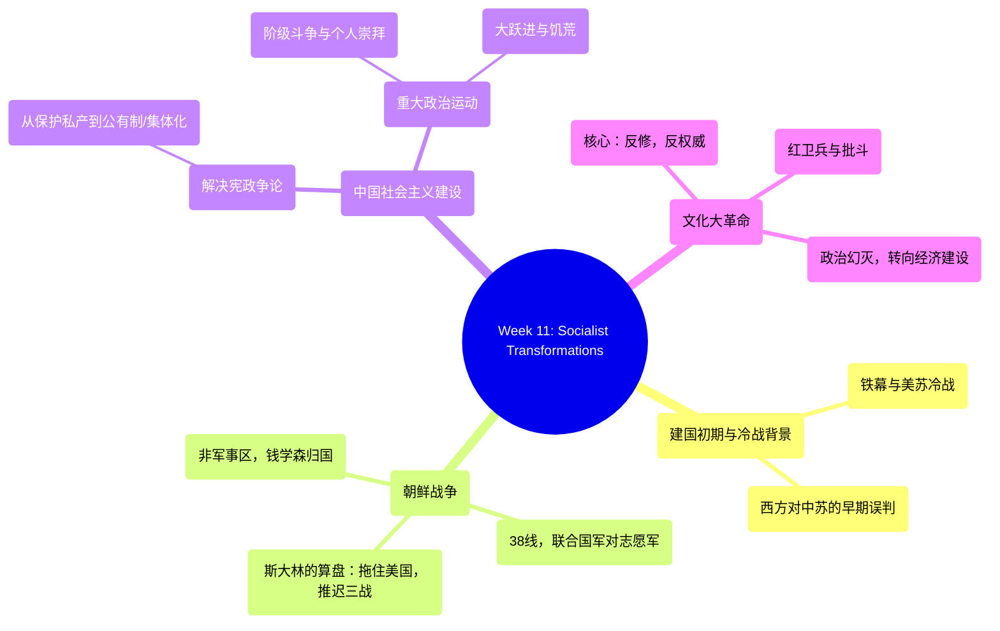

# Week 11: Socialist Transformations (1949-1976) - Analysis & Study Guide

## 1. 逻辑脉络图 / Logical Framework

## 2. 核心概念大白话 / Core Concepts in Plain Language

*   **Four Impressions / 对中苏的“四个印象”**: 
    *   *大白话解说*：二战末期和冷战初期，西方（美国）内部对形势的一些判断。比如认为斯大林放弃了世界革命、需要苏联出兵打日本以减少美军伤亡，甚至误判“中共不是真正的共产党，只是土地改革者”。这些判断影响了美国对华早期的政策。
    *   *Plain English*：Early Western (primarily US) assessments regarding the Soviet Union and the CCP. They included the belief that Stalin renounced world revolution, that Soviet entry into the Pacific War was essential to save American lives, and the crucial misjudgment that the CCP were merely "agrarian reformers" rather than orthodox Communists.
*   **Stalin's Strategic Telegraph (1950) / 斯大林的电报计算**:
    *   *大白话解说*：朝鲜战争爆发后，苏联不仅没在安理会投否决票，反而乐见其成。斯大林在给哥特瓦尔德的电报中说得很明白：让美国深陷朝鲜战场，甚至把中国也卷进去，这样就能把美国的注意力从欧洲引开，无限期推迟第三次世界大战，让欧洲的社会主义阵营有时间巩固。中国成了给苏联挡枪的。
    *   *Plain English*：Stalin's geopolitical calculus during the Korean War. By boycotting the UN Security Council, he deliberately allowed the US to intervene in Korea. His goal was to trap the US in a Far Eastern war, force China into the conflict, and distract American power away from Europe, thereby explicitly delaying WWIII and buying time to consolidate the Soviet bloc.
*   **Resolution of Constitutional Debates / 宪政争论的最终解决**:
    *   *大白话解说*：近代中国一直在吵：保护私有财产还是均贫富？中共建政后直接给出了答案：通过 Redistribution (再分配), Collectivization (农业集体化) 和 Nationalization (工业国有化)，彻底消灭了私有制。
    *   *Plain English*：The longstanding debate over whether the state should protect private property rights or redistribute wealth was decisively settled by the PRC through comprehensive property redistribution, agricultural collectivization, and industrial nationalization.
*   **The Cultural Revolution (1966-1976) / 文化大革命**:
    *   *大白话解说*：毛为了防止“修正主义”（觉得党内走资派要复辟资本主义），发动群众（红卫兵）去造反、打倒一切权威。结果导致十年动乱，最后反而让老百姓对疯狂的政治运动彻底失望（Political Disillusions），为后来邓小平转向“搞经济”铺平了道路。
    *   *Plain English*：A decade-long radical socio-political movement driven by "Anti-Revisionist" and "Anti-Authority" ideologies. Utilizing Red Guards and struggle sessions, it aimed to purge capitalist and traditional elements. Ultimately, its catastrophic chaos led to profound political disillusionment, inadvertently creating the consensus needed for the subsequent shift focus towards economic reform.

## 3. 考点预测与避坑指南 / Exam Topic Predictions & Trap Warnings

1.  **Stalin's Motives in the Korean War (苏联在朝鲜战争中的真实目的)**
    *   *考点*：斯大林给哥特瓦尔德(Gottwald)电报的核心内容。
    *   *坑（Trap）*：千万不要以为苏联是为了“帮小老弟朝鲜大一统”。苏联的真实目的是**欧洲优先（Eurocentric）**，牺牲中朝，把美国（US）Trap in the Far East，从而 Delay WWIII。非常适合考Fact and Significance。
2.  **The "Four Impressions" Misjudgments (四个印象引发的政策后果)**
    *   *考点*：美国早期对中共性质的判断。
    *   *坑（Trap）*：重点记住“CCP are not Communists, but land reformers”。这种误判让美国一度对国共内战采取观望态度，直到冷战铁幕彻底落下。
3.  **Domestic Socialist Transformations (国内的社会主义改造方式)**
    *   *考点*：如何解决Property Rights的问题。
    *   *坑（Trap）*：关键动作是三个词：Redistribution, Collectivization, and Nationalization（再分配，集体化，国有化）。不要写成自由市场经济相关的词汇。
4.  **Legacies of the Cultural Revolution (文革的意外遗产)**
    *   *考点*：文革留下了什么？
    *   *坑（Trap）*：除了灾难，最核心的考点（PPT结尾处）是它带来了 "Political Disillusions" (政治幻灭) 和随后的 "Focus on Economy" (转向经济建设)。物极必反，正是文革的极端破坏促成了后来的改革开放。

## 4. 快问快答 / Quick Q&A Practice

**Q1 (Fact and Significance)**: 
*Event/Concept: Stalin's 1950 Telegraph regarding the Korean War.*
*   **事实 (Facts)**:
    1. Stalin explained why the USSR boycotted the UN Security Council, allowing the US to intervene in Korea. (斯大林解释了苏联为何缺席安理会，放任美国出兵朝鲜)
    2. He aimed to trap the US in the Far East and drag China into the war. (他的目的是让美国深陷远东，并把中国卷入战争)
    3. The ultimate goal was to distract the US from Europe. (最终目的是转移美国对欧洲的注意力)
*   **意义 (Significances)**:
    1. It reveals that the Korean War was strategically weaponized by the USSR to consolidate its own power in Europe at the expense of Asian communist allies. (揭示了朝鲜战争被苏联作为一个战略武器，以牺牲亚洲盟友为代价来巩固自己在欧洲的霸权)
    2. It highlights the brutal realpolitik of the early Cold War, where China and Korea served as proxy battlegrounds to indefinitely delay WWIII between superpowers. (突显了早期的冷战现实主义，中国和朝鲜沦为了超级大国推迟第三次世界大战的代理人战场)

**Q2 (Fact and Significance)**: 
*Event/Concept: Legacies of the Cultural Revolution (1966-1976).*
*   **事实 (Facts)**:
    1. Driven by anti-revisionist and anti-authority motives, it caused extreme chaos via Red Guards and struggle sessions. (出于反修和反权威的目的，通过红卫兵和批斗造成了极大的动乱)
    2. The nationwide chaos eventually had to be suppressed by the army. (全国性的混乱最终不得不依靠军队来镇压)
    3. Key figures like Liu Shaoqi and Lin Biao met tragic ends during this period. (刘少奇、林彪等关键人物在此时期遭遇悲剧性结局)
*   **意义 (Significances)**:
    1. The immense socio-political trauma led to widespread "Political Disillusionment" among the Chinese populace regarding radical ideological struggles. (巨大的社会政治创伤导致了中国民众对激进意识形态斗争的普遍“政治幻灭”)
    2. This exhaustion with endless class struggle pragmatically laid the ideological groundwork for the subsequent leadership (Deng Xiaoping) to decisively shift the national focus toward economic development. (由于对无休止的阶级斗争感到疲惫，这在务实层面上为后来的领导层（邓小平）将国家重心转向经济建设奠定了思想基础)

**Q3 (Short Essay)**:
*Given Viewpoint: "The Western powers fully understood the ideological nature of the Chinese Communist Party during WWII and acted accordingly." Do you agree or disagree?*
*   **Answer Strategy (Disagree / 反对)**:
    1. **The 'Agrarian Reformer' Myth (土地改革者的迷思)**: Based on the "Four Impressions," many in the West fundamentally misjudged the CCP, viewing them merely as "land reformers" rather than orthodox communists aligned with international communism. (基于“四个印象”，西方曾严重误判中共，认为他们只是土地改革者而非共产主义者)
    2. **Contrast with KMT (与国民党的对比)**: The rapid growth of the CCP was interpreted by some Western observers not as an ideological triumph, but simply as a result of the Nationalist (KMT) government’s failure to implement basic political and social reforms, and the CCP's seemingly stronger combat capacity against Japan. (中共的发展被西方仅仅视为国民党腐败和拒不改革的结果，而非意识形态的胜利)
    3. **Underestimating the Cold War Divide (低估了冷战的决裂)**: This misunderstanding temporarily blinded Western policymakers to the impending total alignment of the PRC with the Soviet "Iron Curtain," demonstrating a profound failure to grasp the CCP's long-term ideological commitments prior to the Korean War. (这种误解决定性地导致西方未能预见新中国会彻底倒向苏联铁幕，证明了他们完全没有理解中共的意识形态本质)
