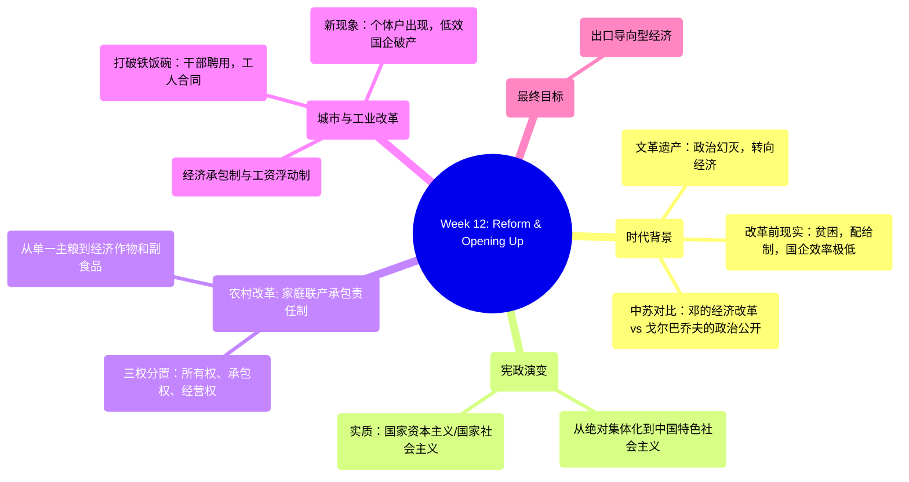

# Week 12: The Reform and Opening Up (1978-1992) - Analysis & Study Guide

## 1. 逻辑脉络图 / Logical Framework

## 2. 核心概念大白话 / Core Concepts in Plain Language

*   **Household Contract Responsibility System / 家庭联产承包责任制**: 
    *   *大白话解说*：以前是人民公社大锅饭，大家干多干少一个样，结果都饿肚子。改革后，土地的“所有权（Ownership）”还是国家的/集体的，但把“承包权（Contract）”和“经营权（Management）”分给了各个农户。交够国家的，留足集体的，剩下都是自己的。大大解放了生产力。
    *   *Plain English*：A rural policy where agricultural land remained officially collectively owned (Ownership), but the rights to contract (Contract) and manage (Management) the land were decentralized to individual households. Farmers could keep or sell produce exceeding their government quotas, incentivizing massive increases in productivity.
*   **Socialism with Chinese Characteristics / 中国特色社会主义**:
    *   *大白话解说*：这其实就是邓小平为了解决宪政争论里“私有财产”问题给出的新答案。名义上还是社会主义，但骨子里引入了市场机制和私有财产的概念，本质上类似于“State Capitalism（国家资本主义）”或“State Socialism（国家社会主义）”。
    *   *Plain English*：Deng Xiaoping’s ideological framework that formally preserved Communist rule while pragmatically introducing market economics, profit motives, and protecting certain private property rights. The PPT equates its practical execution to State Capitalism or State Socialism.
*   **Cradle-to-grave SOEs (danwei) / 铁饭碗与单位制**:
    *   *大白话解说*：改革开放前，城里人一辈子都在一个国有企业（单位）里。企业包揽你从出生到结婚、生病、养老的一切。看似很好，但结果是“Universal Employment = Under-employment” (名为全民就业，实为隐性失业)，效率极其低下。
    *   *Plain English*：The pre-reform urban socio-economic system where State-Owned Enterprises (SOEs) provided lifelong employment and welfare to workers from birth to death. It resulted in massive systemic inefficiencies, essentially disguising mass under-employment as universal employment.
*   **Contrasting Reforms (Deng vs. USSR) / 中苏改革路线对比**:
    *   *大白话解说*：苏联搞了Perestroika（经济重组）和Glasnost（政治公开），结果国家解体了。邓小平看了之后，决定只搞经济上的改革开放，坚决不搞西方式的政治改革（Political Reforms? No.）。
    *   *Plain English*：While the Soviet Union under Gorbachev simultaneously pursued economic restructuring (Perestroika) and political openness/democratization (Glasnost), Deng Xiaoping strictly partitioned the two, aggressively pursuing market economic reforms while heavily suppressing calls for Western-style political liberalization.

## 3. 考点预测与避坑指南 / Exam Topic Predictions & Trap Warnings

1.  **The Three Rights in Rural Reform (农村土地的三权分置)**
    *   *考点*：家庭联产承包责任制到底分了哪些权利。
    *   *坑（Trap）*：一定要记住，**Ownership（所有权）绝对没有分给农民**，仍属集体。下放的只是 **Contract（承包权）** 和 **Management（经营权）**。如果题目说“Deng privatized land ownership”，那是错的。
2.  **The Shift in Constitutional Debates (所有权问题的再次转身)**
    *   *考点*：从建国初期的全面公有制到改革开放的做法。
    *   *坑（Trap）*：建国初期是“Redistribution, Collectivization, Nationalization”。到了邓小平时代，变成了“Socialism with Chinese Characteristics”，其经济实质在课件中被点明为 **State Capitalism / State Socialism**。
3.  **Urban Enterprise Reforms (城市企业改革的四个特征)**
    *   *考点*：如何打破铁饭碗。
    *   *坑（Trap）*：背诵这四个机制：Contracted Enterprises (经济承包制), Hire Cadres (干部聘用制), Employ Workers (工人合同制), Flexible Wages (工资浮动制)。核心是引入了“竞争”和“合同”概念。
4.  **Economic Shift in Agriculture (农业种植结构的转变)**
    *   *考点*：温饱解决后农民种什么。
    *   *坑（Trap）*：不再仅仅是种植单一的主粮（Staple food），开始种植 Cash Crop（经济作物，如棉花）和 Non-Staple Food（副食品，如黄瓜蔬菜）。

## 4. 快问快答 / Quick Q&A Practice

**Q1 (Fact and Significance)**: 
*Event/Concept: The implementation of the Household Contract System (家庭联产承包责任制).*
*   **事实 (Facts)**:
    1. It separated land rights: maintaining collective Ownership while devolving Contract and Management rights to individual households. (分离了土地权利：保留集体所有权，将承包和经营权下放给农户)
    2. Farmers were permitted to grow and sell Cash Crops and Non-Staple Foods after meeting government quotas. (农民在满足国家指标后，被允许种植和销售经济作物和副食品)
    3. It effectively dismantled the inefficient collective communes of the Mao era. (它有效地瓦解了毛时代低效的人民公社体制)
*   **意义 (Significances)**:
    1. It fundamentally solved China's chronic starvation and rationing problems by intrinsically tying personal effort to material reward. (通过将个人努力与物质回报本质上联系起来，从根本上解决了中国长期的饥荒和配给制问题)
    2. It kickstarted the broader Reform and Opening Up era, proving that market-oriented incentives could operate successfully under nominal socialist frameworks. (它开启了更广泛的改革开放时代，证明了市场导向的激励机制可以在名义上的社会主义框架下成功运作)

**Q2 (Fact and Significance)**: 
*Event/Concept: Pre-reform "Cradle-to-grave" State-Owned Enterprises (SOEs).*
*   **事实 (Facts)**:
    1. They functioned as total welfare institutions (danwei/单位) providing housing, healthcare, and lifelong employment. (它们作为全面的福利机构，提供住房、医疗和终身雇佣)
    2. This system resulted in "Universal Employment" which practically meant severe "Under-employment" and stagnation. (这种制度导致了“全民就业”，但实际上意味着严重的隐性失业和停滞)
*   **意义 (Significances)**:
    1. It highlighted the devastating economic inefficiency of pure nationalization where "Time is Money, Efficiency is Life" was completely ignored. (它突显了纯粹国有化的毁灭性经济低效，在这种体制下，“时间就是金钱，效率就是生命”的理念被完全忽视)
    2. The unsustainability of this system forced the brutal but necessary urban reforms like the bankruptcy of SOEs and the introduction of contractual labor. (这一系统的不可持续性迫使国家采取了残酷但必要的城市改革，如允许部分国企破产并引入合同工制)

**Q3 (Short Essay)**:
*Given Viewpoint: "Deng Xiaoping’s reforms were identical in nature to Mikhail Gorbachev’s reforms in the Soviet Union." Do you agree or disagree?*
*   **Answer Strategy (Disagree / 反对)**:
    1. **Soviet Dual Approach (苏联的双轨并行)**: Gorbachev implemented both *Perestroika* (economic restructuring) and *Glasnost* (political openness/democratization) simultaneously, which ultimately dismantled the Soviet political authority. (戈尔巴乔夫同时实施了经济重组和政治公开，最终瓦解了苏联的政治权威)
    2. **Deng's Economic Exclusivity (邓小平的经济专一性)**: Deng firmly rejected Western-style political reforms. His platform of "Socialism with Chinese Characteristics" involved deep economic liberalization (State Capitalism, market incentives) while fiercely maintaining the One Party-State political monopoly. (邓坚决拒绝西方式的政治改革。他的“中国特色社会主义”包含深度的经济自由化，但同时坚决维持一党专政的政治垄断)
    3. **Different Outcomes (不同的结果)**: The USSR collapsed ending the Cold War in Europe, whereas China preserved its political status quo while transforming into a burgeoning Export-Oriented Economy, proving that economic capitalism does not inevitably lead to liberal democracy. (苏联解体终结了欧洲冷战，而中国在维持政治现状的同时转型为蓬勃发展的出口导向型经济，证明了经济资本主义并不必然导致自由民主)
