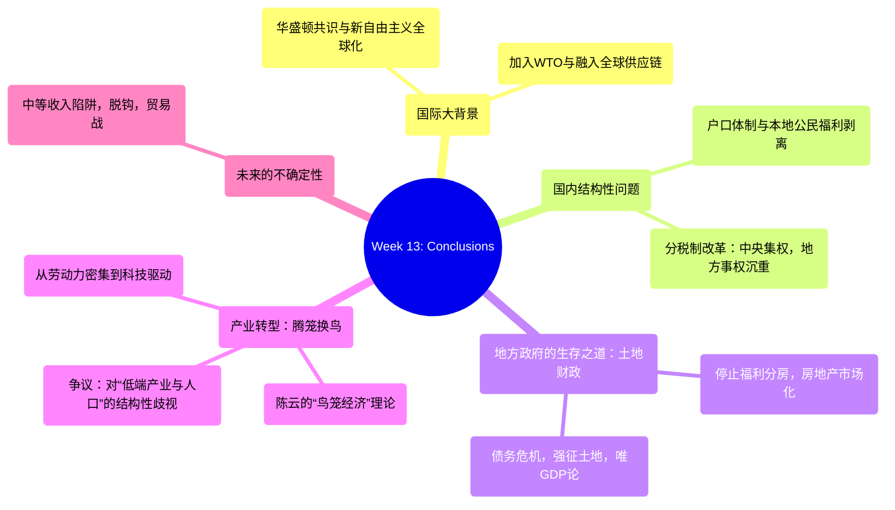

# Week 13: Conclusions (1990-2020s) - Analysis & Study Guide

## 1. 逻辑脉络图 / Logical Framework

## 2. 核心概念大白话 / Core Concepts in Plain Language

*   **1994 Fiscal Reform / 1994年分税制改革**: 
    *   *大白话解说*：中央政府觉得钱不够花，于是改革税制，拿走了大部分赚钱的税种（Fiscal Revenue集中），但把花钱的责任（Education, Healthcare等支出）留给了地方政府。这直接逼迫地方政府去寻找新的“搞钱”门路。
    *   *Plain English*：A major fiscal centralization in 1994 where the central government took a significantly larger proportion of tax revenues while leaving local governments with heavy social expenditure burdens. This structural imbalance forced local governments to find alternative revenue streams.
*   **Land Finance / 土地财政**:
    *   *大白话解说*：地方政府被分税制逼得没办法，加上停止福利分房后房地产市场化，地方政府发现把农村土地极其廉价地征收过来（Land Grab），再高价卖给开发商，太赚钱了。这就成了依靠出卖土地来维持政府运转和搞基建的“土地财政”。
    *   *Plain English*：The system where local governments, squeezed by the 1994 fiscal reform, heavily relied on acquiring rural land at artificially low compensation rates and selling it at high market prices to real estate developers to fund local budgets, infrastructure, and GDP-boosting projects.
*   **Household Registration (Hukou) & Low-end Population / 户口制度与“低端人口”**:
    *   *大白话解说*：虽然农民工进城打工（劳动力密集型经济），但因为没有本地户口，他们享受不到城市的教育、医疗和社保福利。当城市要产业升级时，这些没有技能的农民工就被一些政策制定者视为“低端人口”和不稳定因素，遭到排斥（Structural Discrimination）。
    *   *Plain English*：The residential permit system that ties access to social security, education, and healthcare to a specific locale. It systematically disadvantaged migrant workers in cities, leading to a marginalized class sometimes brutally labeled as the "low-end population" during periods of urban industrial upgrading.
*   **"Empty the Cage for New Birds" / 腾笼换鸟**:
    *   *大白话解说*：原本的经济模式（老鸟）是高能耗、高污染、低端制造（如血汗工厂）。政府现在想把这些“劣势产业”赶走，把资源空出来（腾笼），引进高科技、高附加值的“俊鸟”（换鸟）。但这也引发了争议：中国这么大，如果全搞高端，几亿缺乏高等教育的农民工去哪工作？
    *   *Plain English*：An economic restructuring policy aimed at phasing out outdated, polluting, low-value-added "sunset" industries (the old birds) to make room and resources for high-tech, high-efficiency, advanced industries (the new birds) to avoid the "Middle Income Trap".

## 3. 考点预测与避坑指南 / Exam Topic Predictions & Trap Warnings

1.  **The Cause of Land Finance (土地财政的根本原因)**
    *   *考点*：联系 1994 Fiscal Reform。
    *   *坑（Trap）*：不要只说是“贪婪”。根本原因是财政结构问题：中央拿走了大头收入，但地方要承担大部分公共支出，地方政府为了搞GDP政绩和维持运转，只能被迫依赖卖地。
2.  **Chen Yun’s Bird Cage Theory (陈云的鸟笼经济)**
    *   *考点*：它比喻了国家与市场的关系。
    *   *坑（Trap）*：经济是鸟（Market/Economy），笼子是国家的宏观调控（State control/planning）。太紧鸟会死（经济僵化），没笼子鸟会飞（失控危机）。
3.  **The Debate over "Emptying the Cage" (腾笼换鸟引发的争议)**
    *   *考点*：课件后半部分长篇引用的核心观点。
    *   *坑（Trap）*：这极大概率考Short Essay。支持方认为必须产业升级以打破剥削和瓶颈；反对方强调中国的现实（几亿农民工的就业问题），认为不应一刀切地将低端产业全部赶走，否则会加剧贫富分化和社会冲突。必须是 "expanding" 而不是仅仅 "upgrading"。
4.  **Consequences of GDP-driven Local Governance (唯GDP论的后果)**
    *   *考点*：地方政府为了政绩搞出的乱象。
    *   *坑（Trap）*：记住几个关键词：Fake statistics（数据造假）, Performance projects（面子工程）, Disregard for migrant workers' welfare（无视外来务工人员福利）。

## 4. 快问快答 / Quick Q&A Practice

**Q1 (Fact and Significance)**: 
*Event/Concept: The 1994 Fiscal Reform (分税制改革).*
*   **事实 (Facts)**:
    1. It drastically restructured tax distribution, aggressively centralizing fiscal revenue in the hands of the central government. (重构了税收分配，大力将财政收入集中在中央政府手中)
    2. Local governments were paradoxically left with an oversized share of fiscal expenditures for local public services like education and healthcare. (矛盾的是，地方政府保留了大部分如教育和医疗等地方公共服务支出的责任)
*   **意义 (Significances)**:
    1. The resulting fiscal imbalance structurally cornered local governments into desperately seeking non-tax revenue sources, principally cementing the destructive reliance on "Land Finance." (由此产生的财政失衡在结构上迫使地方政府绝望地寻找非税收来源，主要是巩固了对“土地财政”这种破坏性模式的依赖)
    2. It effectively centralized economic control while decentralizing social crises, exacerbating local wealth gaps and reliance on GDP-boosting short-term projects. (它有效地集中了经济控制权，但下放了社会危机处理责任，加剧了地方贫富差距和对拉动GDP的短期项目的依赖)

**Q2 (Fact and Significance)**: 
*Event/Concept: Chen Yun's "Bird Cage" economic theory (陈云的“鸟笼经济”).*
*   **事实 (Facts)**:
    1. The "bird" represents the dynamic free-market economy. (“鸟”代表动态的自由市场经济)
    2. The "cage" represents the necessary state planning, regulation, and political authority required to contain it. (“笼子”代表遏制它所必需的国家计划、监管和政治权威)
*   **意义 (Significances)**:
    1. It perfectly encapsulated the CCP's core operating paradigm for the post-1978 era: unleashing economic revitalization without surrendering ultimate state oversight and socialist control. (它完美概括了中共1978年后的核心运作范式：在不放弃最终的国家监督和社会主义控制的前提下，释放经济活力)
    2. It highlights why China’s market reforms never naturally transitioned into Western liberal democracy; the "cage" of the single-party state was always fundamentally non-negotiable. (它突显了为什么中国的市场改革从未自然过渡到西方自由民主；因为一党专政的“笼子”从根本上一直是不可谈判的底线)

**Q3 (Short Essay)**:
*Given Viewpoint: "To avoid the Middle-Income Trap, China must aggressively eradicate all its 'low-end' labor-intensive industries to make room for high-tech development." Do you agree or disagree?*
*   **Answer Strategy (Disagree / 反对)**:
    1. **The Employment Reality (庞大的就业现实)**: China is not a small city-state; it has hundreds of millions of low-skill workers who rely entirely on labor-intensive industries. Eradicating these jobs drastically threatens national survival and basic livelihood. (中国不是城邦，有数亿低技能工人依赖劳动密集型产业。消灭这些工作严重威胁基本民生)
    2. **Structural Discrimination ("低端人口"的歧视)**: Rapidly phasing out these industries under the "empty the cage for new birds" policy arbitrarily labels massive swaths of migrant workers as "low-end populations," subjecting them to systemic exclusion from urban centers without viable economic alternatives. (在“腾笼换鸟”政策下快速淘汰这些产业，武断地将大量农民工贴上“低端人口”标签，使他们在缺乏经济替代方案的情况下被系统性地排斥在城市之外)
    3. **Expansion vs. Replacement (扩张与替代之辩)**: As critics in the lecture note, China needs an *expansion* of its industrial structure rather than just a simplistic *upgrading*. The state should develop high-end tech for national competitiveness while simultaneously preserving lower-end manufacturing to prevent exploding wealth gaps and devastating social conflicts. (正如讲座中的批评者所指出的，中国需要扩张其产业结构，而不是简单地升级换代。国家在发展高端科技以增强国家竞争力的同时，必须保留低端制造业，以防止贫富差距爆炸和毁灭性的社会冲突)
