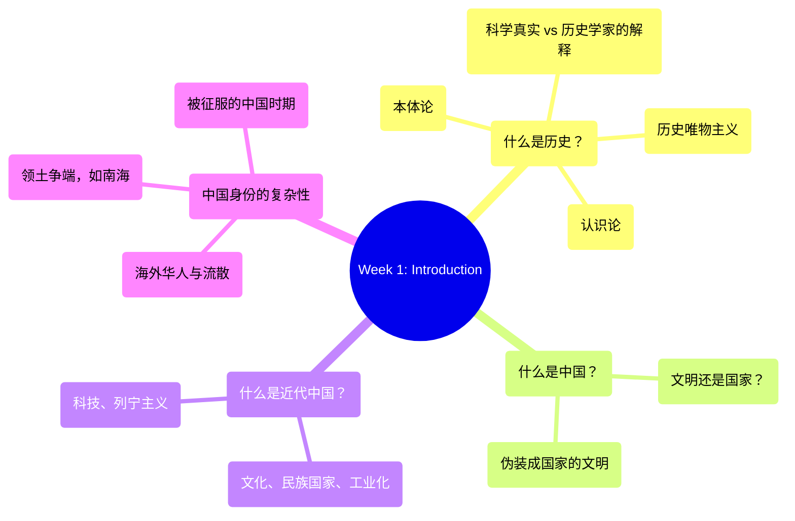

# Week 1: Introduction to GEA2000 - Analysis & Study Guide

## 1. 逻辑脉络图 / Logical Framework

## 2. 核心概念大白话 / Core Concepts in Plain Language

*   **Ontology / 本体论**: 
    *   *大白话解说*：研究“世界到底真实存在什么”的学问。在历史学里，就是探讨历史上的人和事是不是客观存在的（Realists/实在论 vs Antirealists/反实在论）。
    *   *Plain English*：The philosophical study of "what actually exists." In history, it explores whether historical facts are objective realities or just constructed narratives.
*   **Epistemology / 认识论**:
    *   *大白话解说*：研究“我们怎么知道这些事”的学问。历史学家通过什么手段、方法（文献、考古等）来获取关于过去的知识。
    *   *Plain English*：The study of "how we know what we know." It's about the methods and tools historians use to gather historical knowledge.
*   **Historical Materialism / 历史唯物主义**:
    *   *大白话解说*：马克思提出的一种历史观，认为经济基础（大家吃什么、怎么赚钱）决定上层建筑（政治、法律、文化）。课件指出这是中国历史研究的主流（Mainstream）。
    *   *Plain English*：A Marxist theory of history arguing that material/economic conditions fundamentally shape society, politics, and culture.
*   **"A civilization pretending to be a state" / “伪装成国家的文明”**:
    *   *大白话解说*：白鲁恂（Lucian W. Pye）的著名论断，认为中国其实是个庞大古老的文明范畴，硬套上了现代“民族国家”的外壳，以此对比日本（纯粹的国家）。
    *   *Plain English*：Lucian Pye's assertion that China's primary identity is a broad, continuous civilization, rather than a conventional modern nation-state.

## 3. 考点预测与避坑指南 / Exam Topic Predictions & Trap Warnings

1.  **History as "Interpretation" vs. "Reality" (历史是“解释”还是“真实”)**
    *   *考点*：理解历史不仅仅是客观事实（Science/Reality），更是历史学家的主观解释（Interpretations）。
    *   *坑（Trap）*：如果题目问你“历史是绝对客观的科学”，一定选错。要强调解释学（Epistemology）在历史中的作用。
2.  **Lucian W. Pye’s Quote Interpretation (白鲁恂名言辨析)**
    *   *考点*：理解“A civilization pretending to be a state”的深刻含义。
    *   *坑（Trap）*：不要跟 Samuel P. Huntington 评价日本（"Japan is a civilization that is a state"）搞混了。要明白这两者在国家认同上的区别。
3.  **Components of "Modern China" (“近代中国”的构成要素)**
    *   *考点*：课件列出的五个维度：Culture, Nation-State, Industrialization, Technology, Leninism。
    *   *坑（Trap）*：考试可能会让你论述哪个是最核心的转变，或者举例。不能只看政治（民族国家与列宁主义），还要看经济（工业化）和文化。
4.  **Diaspora and Overseas Chinese (流散与海外华人)**
    *   *考点*：讨论“中国”概念的延伸。海外华人（Diaspora）与东道国（Host Country）的关系如何影响我们定义“中国”。
    *   *坑（Trap）*：切忌把现代的政治版图直接等同于文化意义上的“China”。
5.  **Historical Materialism vs. Other Frameworks (唯物史观与其他史观比较)**
    *   *考点*：作为Mainstream的主导地位及其Constructive（建构性）特点。
    *   *坑（Trap）*：不要用西方纯经验主义史观去生搬硬套中国大陆的主流历史叙事。

## 4. 快问快答 / Quick Q&A Practice

**Q1 (Fact and Significance)**: 
*Event/Concept: Lucian W. Pye's characterization of China as "a civilization pretending to be a state."*
*   **事实 (Facts)**:
    1. It was proposed by political scientist Lucian W. Pye. (由政治学家白鲁恂提出)
    2. It highlights that China's core identity stems from a long, continuous civilizational history rather than modern geopolitical borders. (强调中国的核心认同源于漫长文明而非现代地缘边界)
    3. It is contrasted with Japan, which Samuel Huntington called "a civilization that is a state." (与亨廷顿对日本的评价形成对比)
*   **意义 (Significances)**:
    1. It fundamentally changed how Western scholars analyze Chinese statecraft and domestic coherence. (改变了西方学者分析中国国家治理的方式)
    2. It helps explain the complexities of modern Chinese identity, including issues like Diaspora and territorial disputes. (有助于解释近代中国认同的复杂性，如海外华人和领土问题)

**Q2 (Short Essay)**:
*Given Viewpoint: "History is primarily a science of recalling absolute objective reality, rather than a subjective interpretation." Do you agree or disagree? Support with 3-4 points.*
*   **Answer Strategy (Disagree / 反对)**:
    1. **Epistemological limits (认识论局限)**: We can only know the past through surviving evidence, which is always incomplete and filtered (认识论决定了证据的局限性).
    2. **Role of the Historian (历史学家的角色)**: Historians inherently bring their own perspectives and potential biases ("self-interest") to the analysis (导师明确指出历史包含学者的解释和偏见).
    3. **Ontological debate (本体论辩论)**: The existence of "anti-realists" in historical philosophy implies that constructing a single absolute truth is virtually impossible (本体论上的反实在论表明绝对真相难以构建).
    4. **Historiographical schools (主导史观的影响)**: Different frameworks, like Historical Materialism, will shape the same "facts" into completely different narratives (不同史观如历史唯物主义会讲出不同的故事).

**Q3 (Short Essay)**:
*Given Viewpoint: "The definition of 'Modern China' is entirely defined by political shifts such as Leninism and the Nation-State model." Do you agree or disagree?*
*   **Answer Strategy (Disagree / 反对)**:
    1. **Cultural shifts (文化转变)**: "Modern China" also deeply involves cultural transformations such as individualism, changing gender equality, and even fashion/food changes.
    2. **Economic and infrastructural transformation (经济与基建转型)**: Industrialization and technological advancements are equally critical components of China's modernization.
    3. **Transnational aspect (跨国维度)**: The concept extends beyond political borders to include the Chinese diaspora and overseas Chinese influence, which transcends Leninism or traditional nation-state boundaries.
