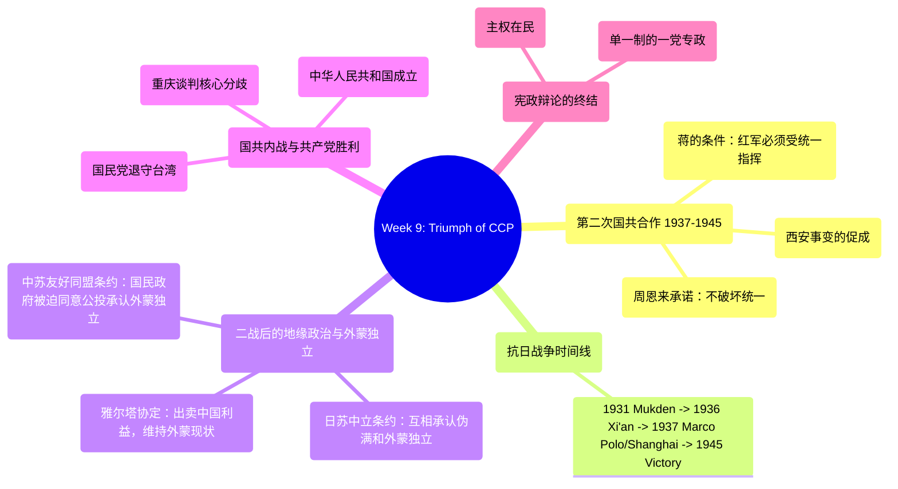

# Week 9: Triumph of the CCP - Analysis & Study Guide

## 1. 逻辑脉络图 / Logical Framework

## 2. 核心概念大白话 / Core Concepts in Plain Language

*   **Second United Front / 第二次国共合作**: 
    *   *大白话解说*：西安事变后，面对日本全面侵华，国共两党不得不重新和好。蒋介石的底线是：红军必须归中央政府统一指挥，不能搞分裂；周恩来满口答应，表示拥护领袖，一致抗日。
    *   *Plain English*：The alliance between the KMT and CCP formed in 1937 to resist the Japanese invasion. It was predicated on the CCP agreeing to formally place its Red Army under the central military command of Chiang Kai-shek and ceasing anti-government rebellions.
*   **Yalta Agreement (1945) / 雅尔塔协定**:
    *   *大白话解说*：二战快打完时，美英苏三巨头背着中国开会。美国为了让苏联出兵打日本，直接把中国的利益卖了，答应苏联“维持外蒙古现状”，还把满洲的特权还给苏联。中国成了大国交易的牺牲品。
    *   *Plain English*：A secret 1945 pact where the US and UK convinced the Soviet Union to enter the war against Japan by explicitly conceding Chinese sovereign interests, importantly agreeing to preserve the "status quo" of Outer Mongolia (meaning its detachment from China).
*   **Outer Mongolia Independence / 外蒙古独立**:
    *   *大白话解说*：本来是中华民国领土。1941年苏联和日本互相勾结，承认对方的伪满洲国和外蒙古共和国。二战后因为雅尔塔会议的压迫，国民政府被迫在1945年妥协，答应只要外蒙自己“公投”同意，中国就承认其独立。
    *   *Plain English*：The geopolitical separation of Outer Mongolia from China. Manipulated by Soviet interests (and previously recognized jointly by the USSR and Imperial Japan), the ROC government was diplomatically strong-armed in 1945 into acknowledging its independence pending a rigged plebiscite.
*   **Chongqing Negotiations / 重庆谈判 (1945)**:
    *   *大白话解说*：抗战刚打完，蒋介石和毛泽东坐在一起谈判。大家鸡同鸭讲：共产党要求“先搞民主选举”，国民党要求“先交出军队（国家军事统一）”。谈不拢，只能打。
    *   *Plain English*：Post-WWII peace talks between Mao and Chiang. They failed fundamentally because their conditions were irreconcilable: the CCP demanded political democracy and elections first, while the KMT demanded immediate national military unification and the surrender of Communist armies.

## 3. 考点预测与避坑指南 / Exam Topic Predictions & Trap Warnings

1.  **Conditions of the Second United Front (第二次国共合作的条件)**
    *   *考点*：根据课件里蒋介石和周恩来的对话。
    *   *坑（Trap）*：蒋介石最在乎的是“国家统一和全国军队的指挥统一”（National unity & Consolidation of military command）。周恩来也是承诺“红军受蒋先生指挥，绝不破坏统一”才换来了合作。
2.  **The Loss of Outer Mongolia (外蒙古到底是怎么丢的)**
    *   *考点*：这是一个复杂的连续外交打击：1941日苏中立条约 -> 1945雅尔塔密约出卖 -> 1945《中苏友好同盟条约》中的换文妥协。
    *   *坑（Trap）*：这题绝对是短文题的大热门。不要只说“被苏联抢走”。要说出背后的大国强权政治（US, UK, USSR at Yalta），以及国民政府在急需苏联不支持中共的压力下的无奈让步（Referendum/公投决定）。
3.  **The Root Cause of the Civil War (国共内战爆发的根本焦点)**
    *   *考点*：1945 Chongqing Negotiations 的核心分歧。
    *   *坑（Trap）*：千万记住，CCP想要的是Democracy and Elections（因为他们在军队上处劣势，希望通过多党制联合政府上台）；KMT想要的是National Military Unity（蒋介石认为一个国家不能有两支军队）。
4.  **How the CCP resolved the Constitutional Debates (中共如何终结近代宪政争论)**
    *   *考点*：课件最后一张幻灯片的结论。
    *   *坑（Trap）*：建国后，主权归谁？The People。国家行态是分权还是集权？是 Unitary, One Party-State (单一制，一党专政)，彻底终结了清末民初关于联邦制还是单一制的争论。

## 4. 快问快答 / Quick Q&A Practice

**Q1 (Fact and Significance)**: 
*Event/Concept: The Yalta Agreement of 1945 and its effect on China.*
*   **事实 (Facts)**:
    1. It was a conference among the Big Three (US, UK, USSR) that took place behind China's back. (美英俄三巨头背着中国秘密召开的会议)
    2. To entice the Soviet Union into the war against Japan, the Allies promised Moscow massive geopolitical concessions in China. (为了吸引苏联对日作战，同盟国向莫斯科许诺了中国巨大的地缘利益)
    3. Specifically, it legally sealed the preserving of the "status quo" in Outer Mongolia and restored historic Russian imperial rights in Manchuria. (明确规定维持外蒙古现状，并恢复沙俄时期在东北的特权)
*   **意义 (Significances)**:
    1. It blatantly proved that the post-WWII international order was still governed by ruthless great-power politics at the extreme expense of weak nations like China. (赤裸裸地证明了二战后的国际新秩序依然是由大国强权政治主导的，极大地牺牲了中国等弱国的利益)
    2. It diplomatically straightjacketed the Nationalist government, forcing them to formally accept the tragic loss of Outer Mongolian sovereignty. (在外交上捆绑了国民政府，迫使其在随后正式接受丧失外蒙古主权的悲剧)

**Q2 (Fact and Significance)**: 
*Event/Concept: The focal point of the Chongqing Negotiations (1945重庆谈判).*
*   **事实 (Facts)**:
    1. Held immediately after the victory over Japan in WWII to prevent a full-scale civil war between the KMT and CCP. (抗战胜利后立刻举行，旨在阻止国共爆发全面内战)
    2. The CCP demanded the establishment of political democracy and free elections (a coalition government) before surrendering their armies. (中共坚持先实现政治民主和自由选举（联合政府）再交出军队)
    3. The KMT demanded absolute national military unity (command unification under Chiang) as a prerequisite for any political concessions. (国民党坚持绝对的国家军事统一（由蒋统一指挥）作为任何政治让步的先决条件)
*   **意义 (Significances)**:
    1. It crystalized the unbridgeable core conflict between the two parties, making the ensuing brutal civil war virtually inevitable. (明确界定了两党不可调和的核心分歧，使得随后残酷的内战几乎不可避免)
    2. It defined the strategic messaging for both sides: KMT fought for state sovereignty and military centralization, while CCP rallied public support under the banner of fighting for democracy. (确立了双方的战略口号：国民党为国家主权和军事集权而战，共产党举起争取民主的旗帜来争取民心)

**Q3 (Short Essay)**:
*Given Viewpoint: "Outer Mongolia gained its independence solely due to the overwhelming democratic will of its population in 1945." Do you agree or disagree?*
*   **Answer Strategy (Disagree / 反对)**:
    1. **Pre-existing Imperial Deals (帝国主义的私相授受)**: Long before any plebiscite, its separation was engineered by great powers. The Soviet Union and Imperial Japan legally recognized its split from China in the 1941 Neutrality Pact to secure their respective imperial zones (Mongolia for USSR, Manchukuo for Japan). (远在公投前，日苏就通过中立条约私分了外蒙和伪满的势力范围)
    2. **Secret Yalta Decisions (雅尔塔的暗箱操作)**: The post-WWII independence was already sealed at Yalta without Chinese participation, where the US traded Mongolian sovereignty for Soviet military entry against Japan. (雅尔塔会议中美国为了换取苏联出兵，背着中国就定了维持外蒙独立的基调)
    3. **Forced Geopolitical Concession (国民政府的被迫妥协)**: The 1945 "referendum" was merely a face-saving facade imposed on the ROC. Republic of China's Foreign Minister Wang agreed to recognize it *only* because of overwhelming Soviet coercion and the dire need to prevent the USSR from fully arming the CCP during the impending civil war. (所谓的公投只是给国民政府留的遮羞布，国民政府妥协的真正原因是被迫向苏联低头以换取苏联不支持中共打内战)
